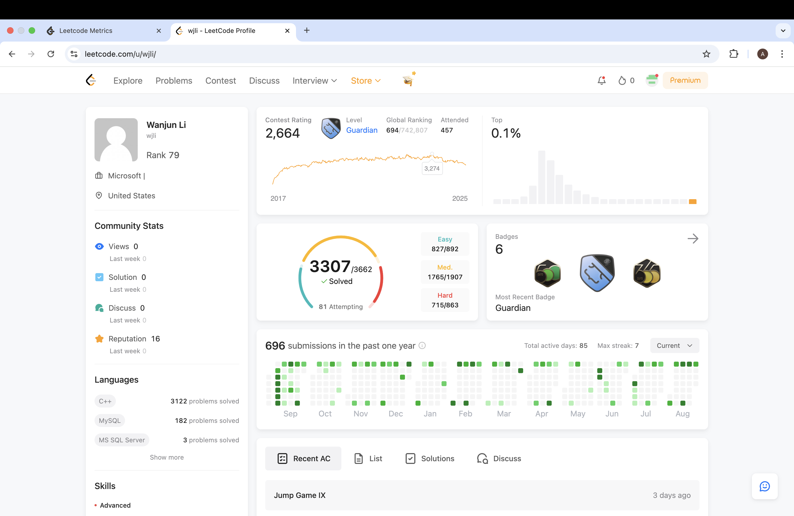
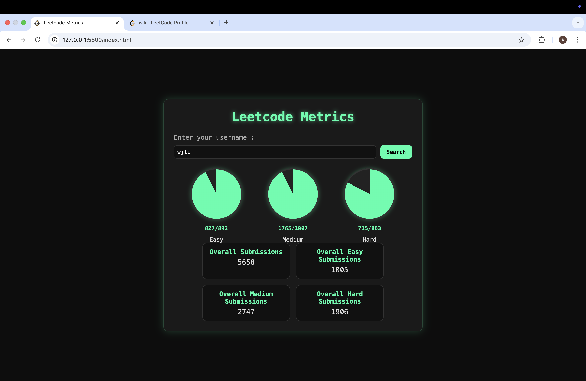
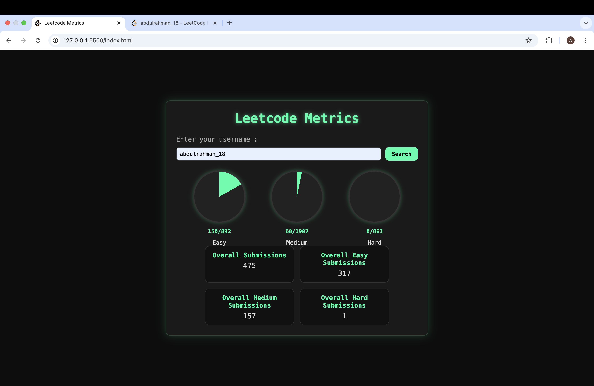
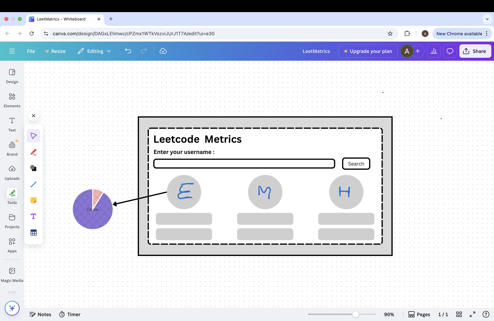
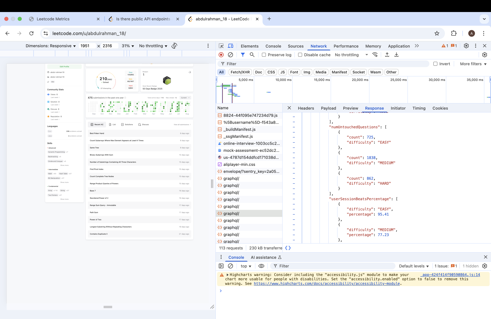
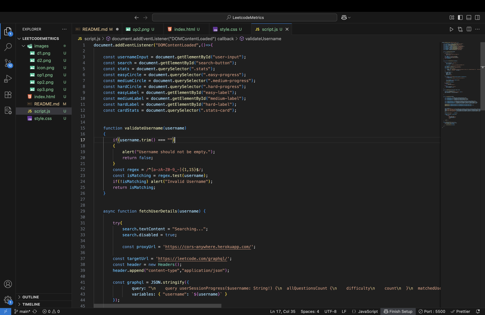
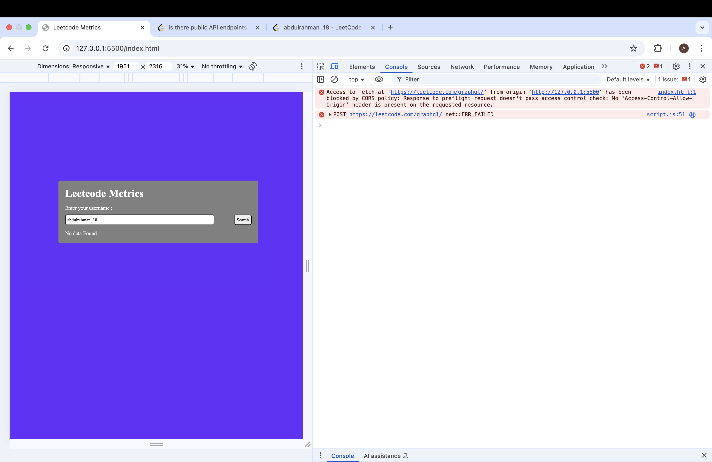

# LeetcodeMetrics

### What is Leetcode Metrics ?
Leetcode Metrics is a site that allows you to fetch crutial info about a leetcode data , such as their progress so far.

You can visit this wbesite here : https://abdul-rahman18.github.io/LeetcodeMetrics/

### What does it actually show ?
It shows 7 crutial thing you need to know about an user, they are : 
- Overall submission of an user.
- Overall Easy Submissions.
- Overall Medium Submissions.
- Overall Hard Submissions.
- Number of Easy questions attempted.
- Number of Medium questions attempted.
- Number of Hard questions attempted.

### How does this work ?
Steps to make this work :
1. Get the username from user input.
2. Validate it
    - To validate it get the regex expressions for leetcode usernames.
    #### it should be something like : 
    ```const regex = /^[a-zA-Z0-9_-]{1,15}$/;```
3. Once you validate it now , you have to fetch user details.
    - We can fetch user profile from api end point : https://leetcode.com/graphql/ , just write a simple query to fetch it.
    ```const graphql = JSON.stringify({
                query: "\n    query userSessionProgress($username: String!) {\n  allQuestionsCount {\n    difficulty\n    count\n  }\n  matchedUser(username: $username) {\n    submitStats {\n      acSubmissionNum {\n        difficulty\n        count\n        submissions\n      }\n      totalSubmissionNum {\n        difficulty\n        count\n        submissions\n      }\n    }\n  }\n}\n    ",
                variables: { "username": `${username}` }
        });```
4. But there's a catch , leetcode does not direct allow me to fetch it, so I used a proxy server to fetch it.
    - what it does is , it takes your url something like this : 
        - https://cors-anywhere.herokuapp.com/ + (your url)
    - Then process your url.
    - I found this on internet on stack overflow : https://stackoverflow.com/questions/29670703/how-to-use-cors-anywhere-to-reverse-proxy-and-add-cors-headers
5. Now , you have all the data in the form JSON.
6. We can simply work with it and display it to the user.

### My key learning : 
I learned :
- How async await actually works.
- How to fetch an API.
- How POST works.
- Learned about proxy servers.
- How to work with JSON.
- Learned error handling.
- and much more...

If you face an issue , something like , No data found , that is due to proxy server. Just to this website : https://cors-anywhere.herokuapp.com/corsdemo and hit "Request temporary access to the demo server" , then wait for few second and it should work fine.

### Output images / website preview : 


> user on leetcode website

> user's details

> My profile

### Images during development : 





